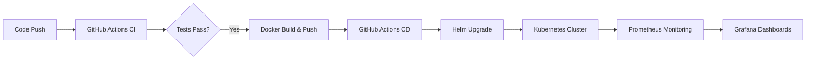

# 🚀 Industry-Grade End-to-End CI/CD Pipeline with Kubernetes

This repository contains a production-ready CI/CD pipeline demonstration, showcasing the full lifecycle of a modern web application.

## 🌟 Key Features

- **Automated Pipeline**: GitHub Actions for CI (Build/Test) and CD (Deployment).
- **Kubernetes Orchestration**: Managed via **Helm Charts** with built-in HPA and health checks.
- **Advanced Deployment**: Templates for **Canary/Blue-Green** deployments.
- **Full Observability**: Integrated **Prometheus** for metrics and **Grafana** for visualization.
- **Optimized Containers**: Multi-stage Docker builds for minimal footprint and security.

## 🏗️ Architecture



## 📂 Project Structure

- `app/`: Node.js Express application with `/health` and `/metrics`.
- `charts/`: Helm charts for Kubernetes deployment.
- `.github/workflows/`: CI/CD automation logic.
- `kubernetes/monitoring/`: Prometheus and Grafana configurations.
- `scripts/`: Automation scripts for local setup.

## 🛠️ Getting Started (Local Setup)

### Prerequisites
- [Docker Desktop](https://www.docker.com/products/docker-desktop/) (Enable Kubernetes)
- [Helm](https://helm.sh/docs/intro/install/)

### Execution
Run the setup script to initialize the entire stack locally:
```powershell
.\scripts\setup.ps1
```

## 🚀 CI/CD Logic

### CI (Continuous Integration)
- Triggers on every Pull Request and Push to `main`.
- Installs dependencies, runs **Jest** tests, and validates Docker build.

### CD (Continuous Deployment)
- Triggers on merge to `main`.
- Pushes image to Docker Hub with a unique SHA tag.
- Performs a zero-downtime `helm upgrade` to the Kubernetes cluster.

## 📊 Monitoring & Rollback

- **Metrics**: The app exports custom metrics like `http_request_duration_seconds`.
- **Dashboards**: Grafana is pre-configured to scrape the app and show real-time performance.
- **Rollback**: If a deployment fails, Kubernetes automatically keeps the old version running (readiness probes), and you can manually rollback using:
  ```bash
  helm rollback web-app [REVISION] -n production
  ```

---
*Created for DevOps Engineering Portfolios & Interview Demonstrations.*
