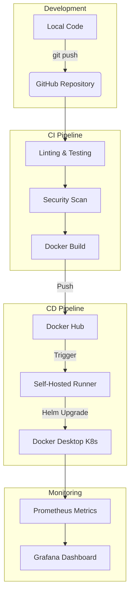

# 🌐 UrbanPulse: Production-Grade Service Marketplace


**UrbanPulse** is a high-performance, containerized marketplace engine for local services. This project demonstrates a complete "End-to-End" DevOps lifecycle—from a Python backend to a secure, automated Kubernetes deployment.

---

## 🚀 Key Features

- **High-Performance API**: Built with **FastAPI** for asynchronous, lightning-fast service matching.
- **Full DevOps Pipeline**: Automated CI/CD using **GitHub Actions**.
- **Containerization**: Optimized **Docker** builds with multi-stage security.
- **Kubernetes Ready**: Orchestrated via **Helm Charts** with built-in health checks.
- **Self-Hosted CI/CD**: Demonstrates professional local deployment using a **GitHub Self-Hosted Runner**.
- **Security First**: Integrated **Trivy** image scanning and **Safety** dependency checks.

---

## 🏗️ System Architecture



---

## 📂 Project Structure

- `app/`: **FastAPI** application logic (Python 3.11).
- `charts/`: **Helm** charts for Kubernetes orchestration.
- `.github/workflows/`: Advanced CI/CD pipeline logic.
- `mobile/`: (Coming Soon) React Native mobile interface.
- `web/`: (Coming Soon) Modern web dashboard.

---

## 🛠️ Local Installation

### Prerequisites
- **Python 3.11+**
- **Docker Desktop** (with Kubernetes enabled)
- **Helm**

### Step-by-Step Setup
1. **Clone & Setup Virtual Env:**
   ```powershell
   git clone https://github.com/kapilverse/UrbanPulse.git
   cd UrbanPulse
   python -m venv venv
   .\venv\Scripts\Activate.ps1
   ```

2. **Install Dependencies:**
   ```powershell
   cd app
   pip install -r requirements.txt
   ```

3. **Run Locally:**
   ```powershell
   uvicorn main:app --reload
   ```
   *Access at: http://localhost:8000*

---

## ⛓️ CI/CD Pipeline Explanation

### Continuous Integration (CI)
- **Linting**: Uses `flake8` to maintain professional code standards.
- **Testing**: Runs `pytest` suite for automated regression testing.
- **Security**: Scans dependencies using `Safety`.

### Continuous Deployment (CD)
- **Environment**: Utilizes a **Self-Hosted Runner** to bridge the gap between GitHub Cloud and your local Kubernetes cluster.
- **Deployment**: Performs a zero-downtime `helm upgrade` on the local `urbanpulse` namespace.

---

## 📊 Observability & Monitoring

The app exports real-time metrics for **Prometheus**:
- **Health**: `/health` endpoint for K8s Liveness/Readiness probes.
- **Metrics**: `/metrics` endpoint for Prometheus scraping.

---
*Developed as a showcase of modern DevOps Engineering and Scalable Backend Architecture.*
